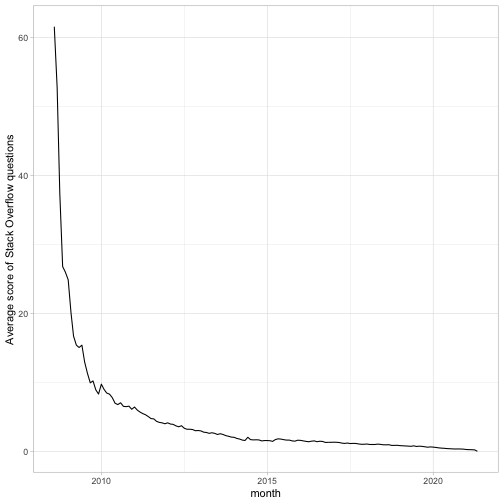
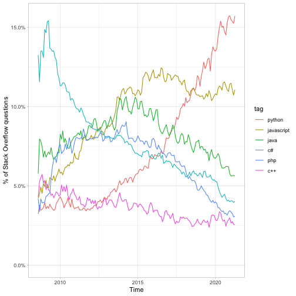

<!-- README.md is generated from README.Rmd. Please edit that file -->


# stackbigquery

<!-- badges: start -->
<!-- badges: end -->

stackbigquery is a package Stack Overflow dataset on bigquery.

This is a minimal example of using [dbcooper](https://github.com/dgrtwo/dbcooper) to create a database package.

## Installation

You can install the development version of stackbigquery from GitHub with:

``` r
devtools::install_github("dgrtwo/stackbigquery")
```

You'll also need to create a Google Cloud project with BigQuery enabled, and set two environment variables in your `.Renviron` file (see [bigrquery](https://bigrquery.r-dbi.org/)).

```
BIGQUERY_BILLING_PROJECT=<your_project>
BIGQUERY_EMAIL=<your_email>
```

The first time you use the package, it may prompt you to authenticate (see the [gargle](https://gargle.r-lib.org/) package for more).

## Examples

Once you've loaded the stackbigquery package, you can use functions prefixed with `stack_` to access the database. This includes

* `stack_list()` to list tables in the database
* `stack_query()` to run a SQL query (and get a remote dbplyr table)


```r
library(dplyr)
library(stackbigquery)

stack_list()
#>  [1] "badges"                     "comments"                  
#>  [3] "post_history"               "post_links"                
#>  [5] "posts_answers"              "posts_moderator_nomination"
#>  [7] "posts_orphaned_tag_wiki"    "posts_privilege_wiki"      
#>  [9] "posts_questions"            "posts_tag_wiki"            
#> [11] "posts_tag_wiki_excerpt"     "posts_wiki_placeholder"    
#> [13] "stackoverflow_posts"        "tags"                      
#> [15] "users"                      "votes"
stack_query("SELECT * FROM tags ORDER BY count DESC")
#> Complete
#> Billed: 0 B
#> Downloading first chunk of data.
#> First chunk includes all requested rows.
#> # Source:   SQL [?? x 5]
#> # Database: BigQueryConnection
#>       id tag_name     count excerpt_post_id wiki_post_id
#>    <int> <chr>        <int>           <int>        <int>
#>  1     3 javascript 2222634         3624960      3607052
#>  2    17 java       1777893         3624966      3607018
#>  3    16 python     1729243         3624965      3607014
#>  4     9 c#         1480991         3624962      3607007
#>  5     5 php        1404048         3624936      3607050
#>  6  1386 android    1336337         3625001      3607484
#>  7     2 html       1072675         3673183      3673182
#>  8   820 jquery     1012658         3625262      3607053
#>  9    10 c++         726181         3624963      3606997
#> 10     4 css         719006         3644670      3644669
#> # … with more rows
```

You can also use autocomplete-friendly table accessors:


```r
stack_posts_questions()
#> Complete
#> Billed: 0 B
#> Downloading first chunk of data.
#> First chunk includes all requested rows.
#> # Source:   SQL [?? x 20]
#> # Database: BigQueryConnection
#>         id title          body           accepted_answer… answer_count comment_count
#>      <int> <chr>          <chr>                     <int>        <int>         <int>
#>  1  3.58e7 Camera with O… "<p>currently…               NA            2             0
#>  2  3.59e7 Configure ato… "<p>How can i…               NA            2             0
#>  3  3.59e7 How does Exch… "<p>I noticed…               NA            1             0
#>  4  3.59e7 CXF with ODat… "<p>Could any…               NA            1             0
#>  5  3.59e7 Why does chai… "<p>So I'm wr…               NA            1             0
#>  6  3.59e7 Algolia searc… "<p>I'm using…               NA            1             0
#>  7  3.60e7 How to use 2 … "<p>We are wo…               NA            4             0
#>  8  3.60e7 How to print … "<p>Im workin…               NA            1             0
#>  9  3.60e7 Can I write t… "<p>I'm tryin…         35978083            1             0
#> 10  3.60e7 XQuery join r… "<p>I have a …         35988035            2             0
#> # … with more rows, and 14 more variables: community_owned_date <dttm>,
#> #   creation_date <dttm>, favorite_count <int>, last_activity_date <dttm>,
#> #   last_edit_date <dttm>, last_editor_display_name <chr>,
#> #   last_editor_user_id <int>, owner_display_name <chr>, owner_user_id <int>,
#> #   parent_id <chr>, post_type_id <int>, score <int>, tags <chr>, view_count <int>
```

These can be used with dbplyr to do joins or summaries.


```r
by_month <- stack_posts_questions() %>%
  group_by(month = DATE_TRUNC(DATE(creation_date), MONTH)) %>%
  summarize(n_questions = n(),
            avg_score = mean(score),
            avg_answers = mean(answer_count)) %>%
  collect()
#> Complete
#> Billed: 0 B
#> Downloading first chunk of data.
#> First chunk includes all requested rows.

by_month
#> # A tibble: 155 x 4
#>    month      n_questions avg_score avg_answers
#>    <date>           <int>     <dbl>       <dbl>
#>  1 2014-12-01      157228     1.56        1.45 
#>  2 2009-07-01       32686    13.0         3.37 
#>  3 2016-01-01      182924     1.59        1.40 
#>  4 2008-07-01           4  1154.         31    
#>  5 2015-06-01      189879     1.78        1.43 
#>  6 2015-03-01      192006     1.45        1.40 
#>  7 2018-06-01      156145     1.01        1.24 
#>  8 2013-04-01      173147     2.61        1.70 
#>  9 2017-02-01      176789     1.31        1.33 
#> 10 2021-01-01      172044     0.264       0.888
#> # … with 145 more rows
```


```r
library(ggplot2)
theme_set(theme_light())

by_month %>%
  filter(n_questions >= 100) %>%
  ggplot(aes(month, avg_score)) +
  geom_line() +
  labs(y = "Average score of Stack Overflow questions")
```



### Summarize tags

As a database-specific package, stackbigquery also offers useful verbs for doing common operations on the data.

For instance, `summarize_tags` takes a (potentially grouped) version of `stack_posts_questions`, joins it to the tags table, and aggregates the frequency by tag.


```r
by_month_tag <- stack_posts_questions() %>%
    group_by(month = DATE_TRUNC(DATE(creation_date), MONTH)) %>%
    summarize_tags(c("javascript", "java", "python", "c#", "php", "c++"))
#> Complete
#> Billed: 0 B
#> Downloading first chunk of data.
#> First chunk includes all requested rows.
#> Complete
#> Billed: 0 B
#> Downloading first chunk of data.
#> First chunk includes all requested rows.

by_month_tag
#> # A tibble: 925 x 5
#>    month      tag        number  total percent
#>    <date>     <chr>       <int>  <int>   <dbl>
#>  1 2021-05-01 php          6103 178334  0.0342
#>  2 2016-03-01 c++          7038 203678  0.0346
#>  3 2013-12-01 java        17516 167435  0.105 
#>  4 2008-09-01 c#           1650  14267  0.116 
#>  5 2008-08-01 python        124   3846  0.0322
#>  6 2008-08-01 javascript    162   3846  0.0421
#>  7 2014-05-01 php         14882 178727  0.0833
#>  8 2015-01-01 python       9700 167951  0.0578
#>  9 2015-01-01 php         13704 167951  0.0816
#> 10 2014-12-01 php         12428 157228  0.0790
#> # … with 915 more rows
```


```r
library(ggplot2)
library(forcats)

by_month_tag %>%
  filter(month != max(month),
         month != min(month)) %>%
  arrange(month) %>%
  mutate(tag = fct_reorder(tag, -percent, last)) %>%
  ggplot(aes(month, percent, color = tag)) +
  geom_line() +
  scale_y_continuous(labels = scales::percent_format()) +
  expand_limits(y = 0) +
  labs(x = "Time",
         y = "% of Stack Overflow questions")
```



### Code of Conduct

Please note that the 'stackbigquery' project is released with a
[Contributor Code of Conduct](CODE_OF_CONDUCT.md).
By contributing to this project, you agree to abide by its terms.
